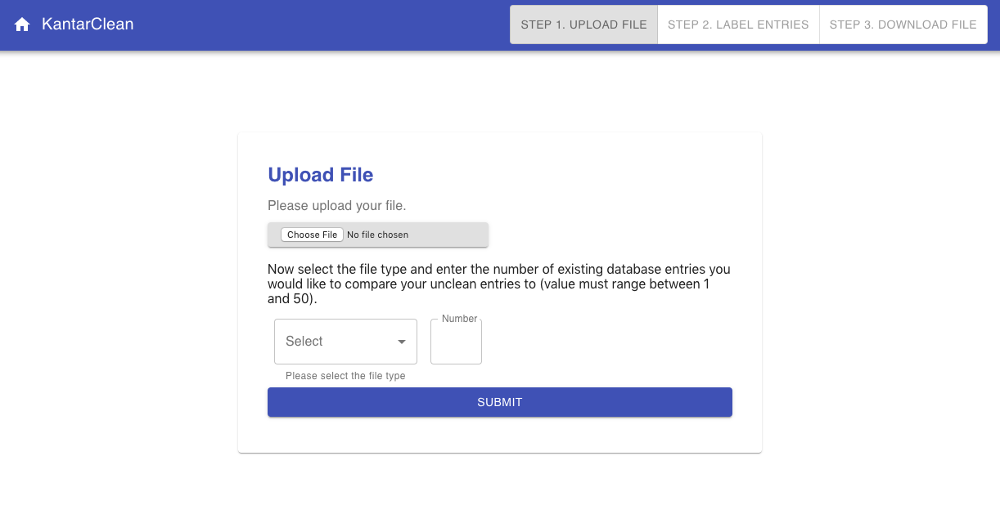
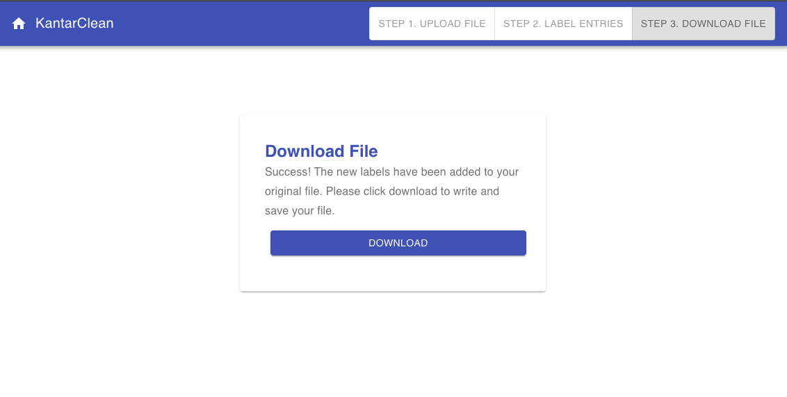

# dbClean
> Recommendation app for monthly cleaning of pharmaceutical database entries.

[![Build Status][travis-image]][travis-url]

Built for a summer internship project, this flask-react app is designed to take a formatted excel document as input, the classification task (tumor or drug data), and the number of neighbors from the "clean" database entries that the user would like to compare his/her unclean entries with.

### API
A collaborative filtering method is used to generate label suggestions for unclean database entries. The inputted excel file should contain both labeled and unlabeled database entries. The text entries are normalized and transformed (TF-IDF vectorization), then a nearest neighbors algorithm (Scikit-Learn) is used to generate the nearest labeled neighborhood for each of the unlabeled entries. The neighbors in the neighborhood are rendered in the UI component. 

### UI
An interactive table interface is used to present recommendations to the user. The user can select multiple labels (and sublabels) for each unlabeled entry in the excel file. In addition, if the correct label is not presented the user may also type the correct label/sublabel after clicking "Add Other." The text boxes are autoselect components that dynamically render suggestions as the user begins to type potential label names.

## Installation & Startup

[Install Docker](https://docs.docker.com/v17.09/engine/installation/)

OS X & Linux & Windows:

```sh
git clone https://github.com/keenanberry/dbClean.git
cd dbClean
docker-compose up -d
```

When finished...

```sh
docker-compose down
```

## Usage example







## Meta

Keenan Berry – keenanberry22@gmail.com

[https://github.com/keenanberry/github-link](https://github.com/keenanberry/)

<!-- Markdown link & img dfn's -->
[travis-image]: https://img.shields.io/travis/dbader/node-datadog-metrics/master.svg?style=flat-square
[travis-url]: https://travis-ci.com/keenanberry/dbClean
[wiki]: https://github.com/yourname/yourproject/wiki
